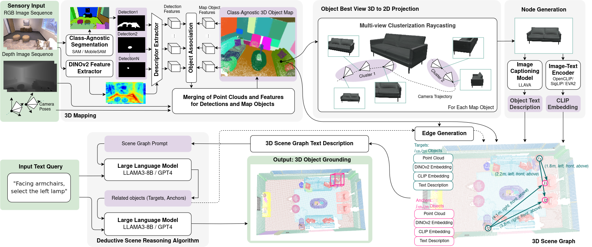

<p align="center">

  <h1 align="center">Beyond Bare Queries: <br>
Open-Vocabulary Object Grounding <br> with 3D Scene Graph</h1>
  <p align="center">
    <a href="https://github.com/linukc">Linok Sergey</a>
    ·
    <a href="https://github.com/wingrune">Tatiana Zemskova</a>
    ·
    Svetlana Ladanova
    ·
    Roman Titkov
    ·
    Dmitry Yudin
    <br>
    Maxim Monastyrny
    ·
    Aleksei Valenkov
  </p>

  <h4 align="center"><a href="https://linukc.github.io/BeyondBareQueries/">Project</a> | <a href="http://arxiv.org/abs/2406.07113">arXiv</a> | <a href="https://github.com/linukc/BeyondBareQueries">Code</a></h4>
  <div align="center"></div>
</p>

<p align="center">

</p>

Репозиторий для кода для демонстрации работы пайплайна BBQ на роботе с отправкой запроса пользователя через Телеграм-бот.

В репозитории представлен модифицированный код пайплайна BBQ, ссылка на оригинальный репозиторий: https://github.com/linukc/BeyondBareQueries.

0. Сборка докер-образа с BBQ:

```
cd BeyondBareQueries
bash docker/build.sh
```

1. Запуск контейнера BBQ:

```
bash start.sh /datasets/
```

2. Запуск сущностей, живущих на компьютере с пайплайном (запуск из контейнера, зайти в контейнер - `bash ./into.sh`). Каждая сущность запускается в отдельном окне терминала:

a. Телеграм-бот:

```
bash ./into.sh
bash bot.sh
```

b. Сервер с PLM моделью:

```
bash ./into.sh
conda activate perception_models
cd ~/BeyondBareQueries/BeyondBareQueries/bbq/models
CUDA_VISIBLE_DEVICES=1 uvicorn plm_server:app --host 0.0.0.0 --port 31623
```

c. Сервер с BBQ пайплайном:

```
bash ./into.sh
cd ~/BeyondBareQueries/BeyondBareQueries
bash server.sh
```


d. Сервер с демо:

```
bash ./into.sh
conda activate perception_models
cd ~/BeyondBareQueries/BeyondBareQueries
python demo_local.py
```

После чего либо воспользоваться автоматическим пробросом портов от VS Code, либо самому пробросить порты так, чтобы можно было визуализировать демо в браузере компьютера, подключенного к серверу.

3. Запуск сервера, отдающего изображения:

a. Локальный сервер (по запросу отдаёт заранее сохраненные изображения):

```
bash ./into.sh
python local_camera_server.py
```


b. Сервер с камерами на роботе:

```
aima em load-env
cd ~/bbq_demo/
python3 camera_server.py
```

4. Остановить контейнер с демо:

```
bash ./stop.sh
```

## Citation
If you find this work helpful, please consider citing our work as:
```
@misc{linok2024barequeriesopenvocabularyobject,
      title={Beyond Bare Queries: Open-Vocabulary Object Grounding with 3D Scene Graph}, 
      author={Sergey Linok and Tatiana Zemskova and Svetlana Ladanova and Roman Titkov and Dmitry Yudin and Maxim Monastyrny and Aleksei Valenkov},
      year={2024},
      eprint={2406.07113},
      archivePrefix={arXiv},
      primaryClass={cs.CV},
      url={https://arxiv.org/abs/2406.07113}, 
}
```